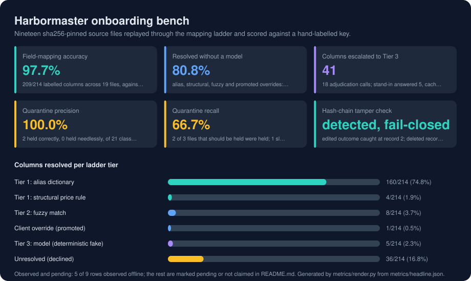

# Harbormaster

Intelligent file-arrival control for financial reconciliation.

---

## At a glance

| | |
|---|---|
| **The problem** | Client, custodian and exchange files land under unreliable names in a dozen formats, and the reconciliation engine has to be told which client, which value date, and which of four price columns is the price. |
| **What it does** | Multi-format intake, JSON queue ingress, write-completion detection, duplicate/redelivery handling, content-based value-date resolution, client attribution, tiered field mapping with deterministic and model-backed paths, quarantine/four-eyes review, slot lifecycle, missing-file alerts, hash-chained audit, and a live operations console with `/api/ops`. |
| **Stack** | Go services, Python inference/parsing layer, Protobuf contracts, Kafka/Redpanda-compatible topics, Postgres read models, Docker Compose, embedded Go templates, HTMX, deterministic corpus generation. |
| **Validation** | Go unit/contract tests and `go vet`; Python ruff/mypy/pytest; 17 named adversarial scenario tests; cross-language protobuf and masking parity checks; documented Docker, e2e, audit, and live-model gates. |

<!-- metrics:start -->

## Results



Every figure below was observed by `make bench`, which runs offline with a fixed seed and no API key, and writes `metrics/headline.json`. Nineteen sha256-pinned source files replayed through the mapping ladder and scored against a hand-labelled key. Rows marked *pending* need hardware, data or a service the offline harness does not have; nothing here is estimated.

| Metric | Value | How it was measured |
|---|---|---|
| Field-mapping accuracy | **97.7%** | 209/214 labelled columns across 19 files, against bench/golden |
| Resolved without a model | **80.8%** | alias, structural, fuzzy and promoted overrides: 173/214 columns |
| Columns escalated to Tier 3 | **41** | 18 adjudication calls; stand-in answered 5, cache replayed 0; not a live-model accuracy |
| Quarantine precision | **100.0%** | 2 held correctly, 0 held needlessly, of 21 classifications |
| Quarantine recall | **66.7%** | 2 of 3 files that should be held were held; 1 slipped through |
| Hash-chain tamper check | **detected, fail-closed** | edited outcome caught at record 2; deleted record caught at record 2 |

**Columns resolved per ladder tier**

| | | |
|---|---|---|
| Tier 1: alias dictionary | `███████████████░░░░░` | 160/214 (74.8%) |
| Tier 1: structural price rule | `░░░░░░░░░░░░░░░░░░░░` | 4/214 (1.9%) |
| Tier 2: fuzzy match | `█░░░░░░░░░░░░░░░░░░░` | 8/214 (3.7%) |
| Client override (promoted) | `░░░░░░░░░░░░░░░░░░░░` | 1/214 (0.5%) |
| Tier 3: model (deterministic fake) | `░░░░░░░░░░░░░░░░░░░░` | 5/214 (2.3%) |
| Unresolved (declined) | `███░░░░░░░░░░░░░░░░░` | 36/214 (16.8%) |

**Observed and pending**

| | Status | Evidence |
|---|---|---|
| Fixed source set | observed | 19 files, 21 classifications, seed 20260831, sha256-pinned |
| Golden labels | observed | 214 column labels, 21 disposition labels, hand-derived |
| Per-tier accuracy | observed | alias 160/160 (100.0%), structural 4/4 (100.0%), fuzzy 6/8 (75.0%), override 1/1 (100.0%), llm 3/5 (60.0%), unresolved 35/36 (97.2%) |
| Model-resolved columns | observed | 5 by the deterministic fake or its cache; 0 cache replays |
| Hash-chain tamper check | observed | detected, fail-closed: edited outcome caught at record 2; deleted record caught at record 2 |
| Tier 2 semantic matcher | pending | fuzzy-only; fastembed not installed, so the embedding path did not run |
| Live model (Claude) mapping accuracy | pending | not measured offline; needs ANTHROPIC_API_KEY and HM_LIVE=1 make test-live |
| Duplicate and redelivery suppression | pending | not measured here; Portwatch dedupe is asserted against Postgres (make test-store) |
| Throughput and p95 latency (NFR-2) | pending | not measured; needs the running stack (make up) |

<!-- metrics:end -->

---

## The problem

A bank reconciles trades, positions, cash and collateral against its general
ledger. The internal side is well controlled. The external side is not.

Client, custodian and exchange reports arrive all day into a single FTP landing
directory as CSV, Excel, XML, FIXML and free-text email bodies, with a parallel
stream of JSON messages from upstream integrations. Every venue names its
columns differently: ICE writes `Settle Px`, Eurex writes `SettlPric`, LSEG
writes `Valuation Price`. Filenames are unreliable. A file produced late at the
client carries yesterday's business under today's date stamp.

The reconciliation engine downstream is deliberately simple. It is configured
with an expected file on each side and it matches records. It cannot determine
which value date a file's contents belong to, which client produced it, or which
column in a twelve-column price block is the trade price rather than the
settlement price. It has to be told.

Harbormaster is what tells it.

```
FTP drop ─┐
          ├─► Harbormaster ─► berth assignment ─► reconciliation engine
JSON queue ┘                  (client, value date, both file sides)
```

Files arrive at a port under many flags. The harbormaster identifies each
vessel, reads its cargo, works out which tide it sailed on, and issues a berth
assignment.

## The hard part

Not parsing. Parsing is the easy half.

**Which day is this, really.** A file named `MCP_TRD_20260831.csv` landing at
06:40 on the 31st routinely contains the 28th's business. Reconciling it against
the 31st's ledger breaks on every row, and an analyst spends a morning
discovering that nothing was wrong except the date. Harbormaster consults three
independent sources, ranks them by how much they actually know, and always
surfaces a disagreement rather than resolving it silently.

**Which price is the price.** A cleared-futures extract carries traded price,
prior settlement, official settlement and a mark. Swap two of them and the
reconciliation still runs, still returns a number, and is wrong. Header
vocabulary resolves most of them. What resolves the rest is structure: a
settlement price is a property of an instrument on a day and repeats across
rows, while a trade price is a property of an execution and varies.

**When to stop guessing.** A wrong mapping is more expensive than an unresolved
one, because unresolved becomes a review item while wrong becomes a silent
break. Harbormaster declines, quarantines and asks, and every reason it gives
names what it could not decide.

## What it does

| | |
|---|---|
| **Watches** | An FTP landing directory and a JSON queue, detecting when a file is genuinely finished being written |
| **Recognises** | Exact duplicates, redeliveries under a new name, and corrections that supersede an already-dispatched reconciliation |
| **Resolves** | The true value date from content, filename and arrival time, against each client's business calendar |
| **Attributes** | The owning client from filename patterns and embedded account identifiers, scoring agreement rather than following a priority order |
| **Maps** | Every source column onto one canonical schema, through three escalating tiers, recording the evidence for each decision |
| **Decides** | Dispatch, quarantine or reject, with a composite confidence and a specific reason |
| **Dispatches** | A berth assignment naming both file sides, the client and the value date |
| **Records** | Every decision in a tamper-evident hash chain, so any dispatch can be explained months later |

## Architecture

Six services over a Kafka-compatible log. Everything communicates through
durable, replayable topics, which makes the audit trail a property of the
architecture rather than a feature bolted onto it.

```
        FTP landing dir            upstream JSON queue
               │                            │
               ▼                            ▼
        ┌──────────────────────────────────────┐
        │  PORTWATCH               (Go)        │  arrival detection, write-
        │                                      │  completion, hashing, dedupe
        └──────────────────┬───────────────────┘
                           │ hm.arrivals.raw
                           ▼
        ┌──────────────────────────────────────┐
        │  INSPECTOR               (Python)    │  format sniffing, parsing,
        │                                      │  attribution, value-date
        │                                      │  resolution, field mapping
        └────────┬─────────────────┬───────────┘
                 │                 │ hm.arrivals.quarantined
   hm.arrivals.classified          ▼
                 │           review queue ◄── hm.review.decisions
                 ▼                 │
        ┌────────────────────────▼─────────────┐
        │  BERTHMASTER             (Go)        │  slot state machine, late
        │                                      │  window, supersession
        └──────────────────┬───────────────────┘
                           │ hm.berth.assigned / .superseded / alerts.missing
              ┌────────────┴────────────┐
              ▼                         ▼
      ┌───────────────┐        ┌──────────────────┐
      │ RECON STUB    │        │ CONTROL PLANE(Go)│──► operations console
      └───────────────┘        └──────────────────┘
```

Go sits at the edges, where the work is I/O, concurrency and uptime. Python sits
in the middle, where the work is data shape and inference. Message contracts are
defined once in Protobuf and generated for both languages, so cross-language
drift is a build failure rather than a silent field mismatch in production.

Full rationale for every significant choice is in
[`docs/design/decisions.md`](docs/design/decisions.md) — twenty numbered
decisions with their context, consequences and costs.

## The three-tier mapping ladder

| Tier | Mechanism | Cost | Handles |
|---|---|---|---|
| 1 | Alias dictionary over normalised headers | microseconds | The columns the industry already has a name for |
| 2 | Fuzzy string match plus local sentence embeddings | milliseconds | Abbreviations, near-misses, different words for the same thing |
| 3 | Claude, given headers, samples and client context | seconds, and money | Genuinely novel layouts and free-text bodies |

Escalation is one-way: each tier only sees what the previous one declined, and a
column the dictionary resolved is never re-litigated by a model. Results are
cached by template fingerprint, so the second file with a given layout costs
nothing, and a reviewer can promote a confirmed mapping into the client's
configuration, after which it resolves at Tier 1 permanently.

Model dependence therefore decreases as the system runs, rather than growing
with volume.

## Running it

Requires Docker and `make`.

```bash
make up          # start the stack; the board is at http://localhost:8080
make demo        # drive the adversarial corpus through it, narrated
make verify-audit
make down
```

To develop:

```bash
cd go && go mod tidy   # once, on first checkout
make check             # every static and unit gate, fully offline
make test-scenarios    # the twelve named adversarial cases
```

`make check` runs with no broker, no network and no API key. The model tier sits
behind an interface with a deterministic stand-in bound by default, so the whole
suite is reproducible offline. Enabling the live tier is an explicit act:

```bash
HM_ADJUDICATOR=claude ANTHROPIC_API_KEY=... make up
HM_LIVE=1 make test-live
```

## Reference corpus

Correctness targets are measured against a committed synthetic corpus, generated
deterministically with eight venue vocabularies across five currencies. Twelve of
its fixtures are adversarial by design, each documenting what it is built to
break:

| Case | Designed to break |
|---|---|
| Late arrival | Routing a late file onto today's ledger |
| Filename/content disagreement | Trusting the filename date |
| Exact duplicate | Double-counting a resent reconciliation |
| Redelivery under a new name | Recognising files by name rather than content |
| Correction after dispatch | Leaving a stale reconciliation in place |
| Multi-date file | Forcing mixed dates onto one value date |
| Four price columns | Conflating trade price with settlement or mark |
| Bare `Price` header | Header-only mapping, which cannot separate these |
| Email cash advice | Assuming every arrival is tabular |
| Unattributable file | Guessing an owner rather than asking |
| Awkward workbook | Reading sheet zero, row zero and trusting it |
| Preamble and totals row | Counting a summary line as a trade |

Each has a named test in `tests/scenarios/`, so a regression fails with a name
that says what broke.

## Documentation

| | |
|---|---|
| [Overview](docs/OVERVIEW.md) | The setting, the three hard problems, the mapping ladder, what is measured |
| [Showcase](docs/SHOWCASE.md) | A guided tour of every feature, with commands and files |
| [Codebase graph](docs/graph/README.md) | Query the code with `graphify` instead of grepping it: `explain`, `path`, `affected` |
| [Requirements](docs/design/01-requirements.md) | 42 functional and 12 measurable non-functional requirements |
| [High-level design](docs/design/02-hld.md) | Architecture, component split, tech-stack rationale |
| [Low-level design](docs/design/03-lld.md) | Frozen contracts, schemas, error taxonomy, test strategy |
| [Execution plan](docs/design/04-execution-plan.md) | Milestones, 50 tasks, validation gates |
| [Decisions](docs/design/decisions.md) | Twenty ADRs with context, consequences and costs |
| [Runbook](docs/runbook.md) | Start, seed, demo, verify, teardown, and what to do when it breaks |
| [Ship report](docs/ship-report.md) | Gate results, measured correctness, known issues |
